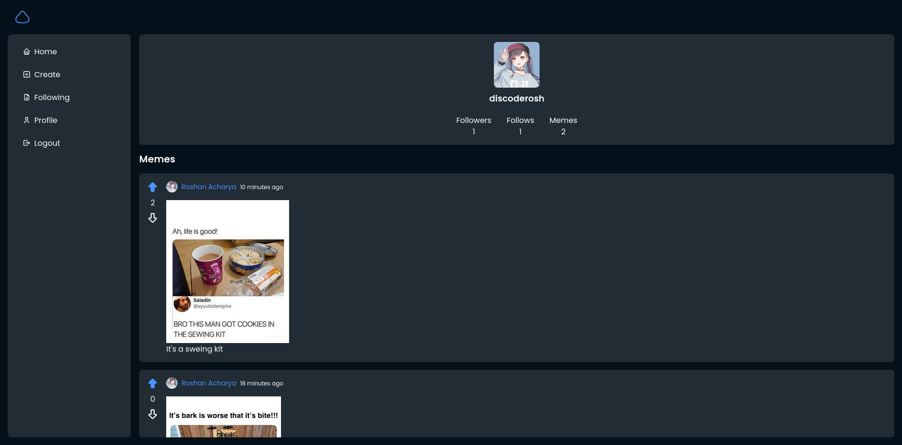
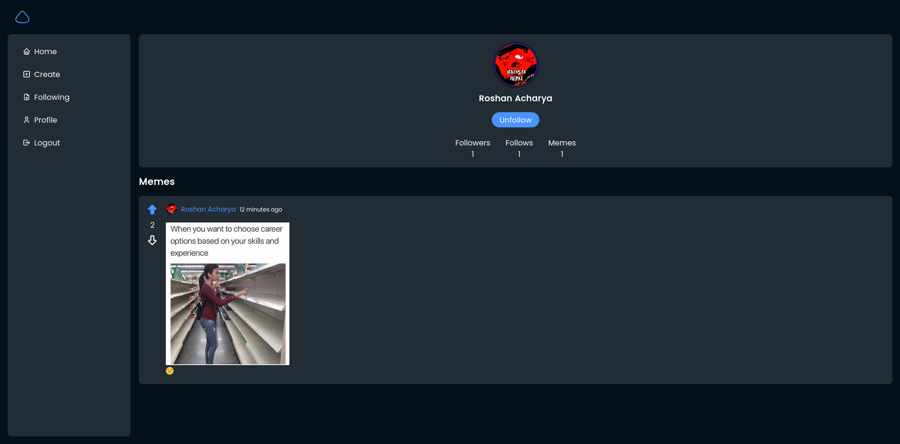

<p align="center">
    
</p>

<h1 align="center">Meme-ory</h1>

<p align="center">Meme sharing platform.</p>

> Assignment of `Web Technologies and Applications`

## Setup

```sh
git clone https://github.com/coderosh/memeory.git
cd memeory

cp .env.example .env
# set environment variables in .env file

pnpm install
pnpm dev
```

## Features

- [x] Share meme
- [x] Upvote and Downvote
- [x] Follow, unfollow
- [ ] Comments
  - [x] Comment in meme
  - [ ] Reply comments
  - [x] Upvote/Downvote
- [ ] Pagination
- [ ] Tags
- [ ] User settings
- [ ] Notifications
- [ ] Filter based on likes/date
- [ ] Search memes

## Screenshots




